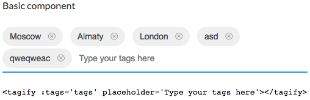

# Tagify component for Vue

> Tagify Component for Vue 2.0

<p align="center">
    
</p>

## Installation
```bash
npm install --save tagify-vue
```

```javascript
import Tagify from 'tagify-vue'
```

## Usage
```html
<tagify :tags='tags' placeholder='Type your tags here'></tagify>
```
